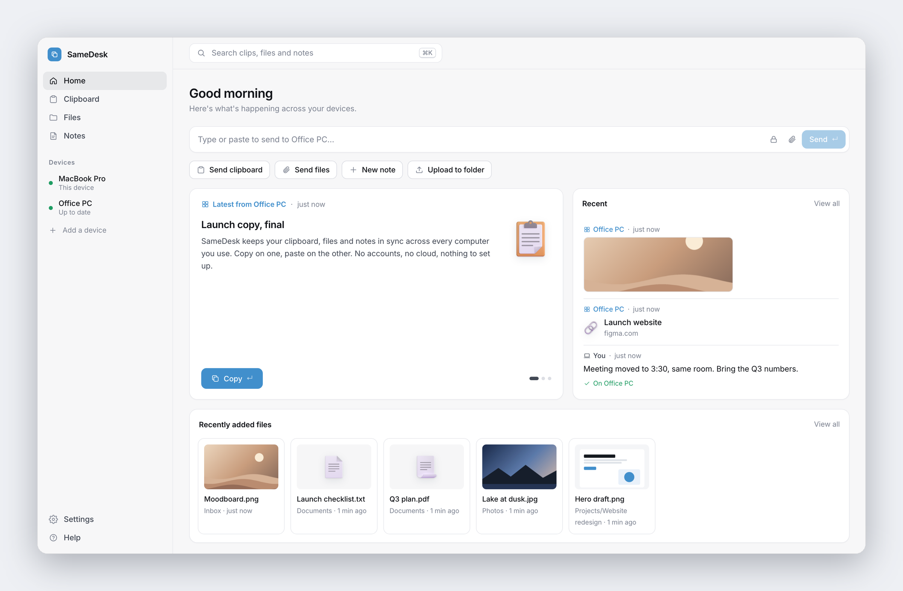
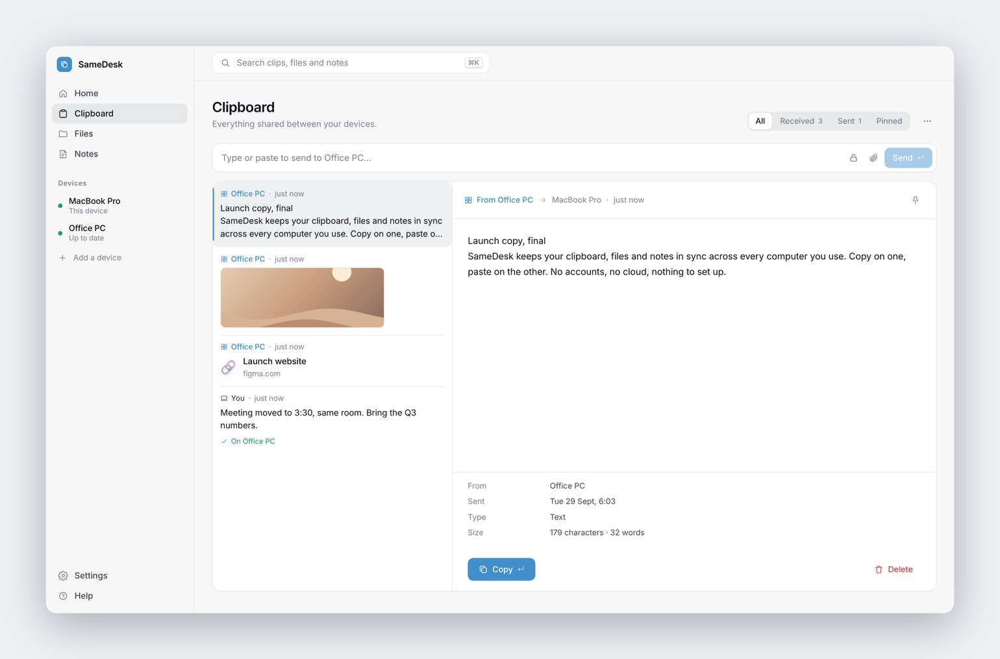
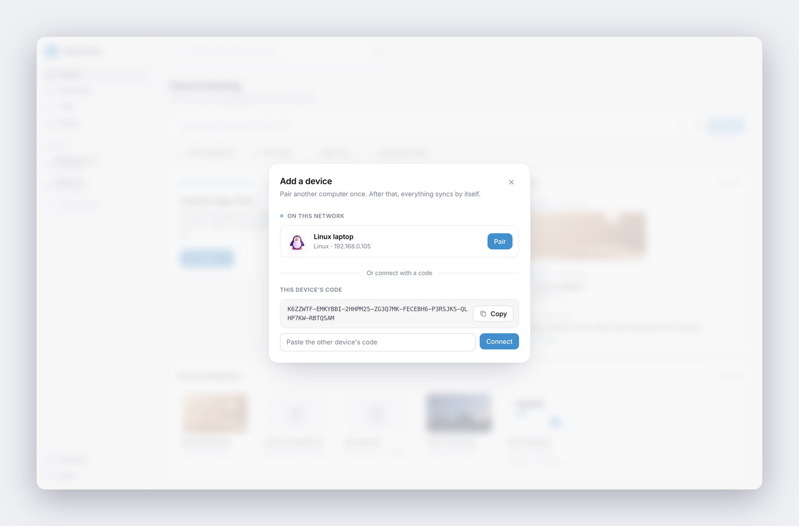
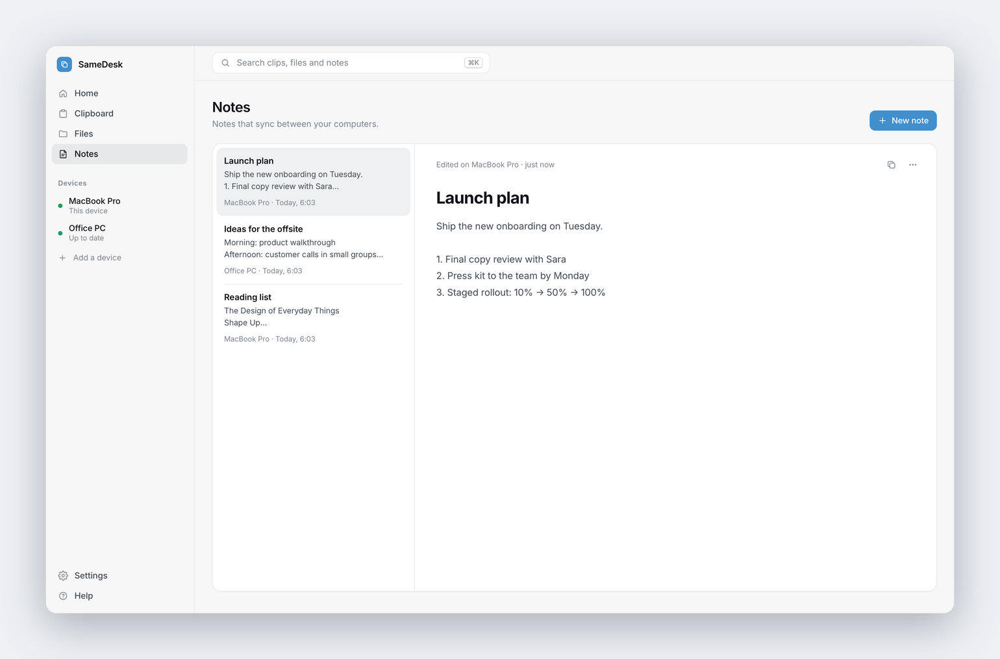
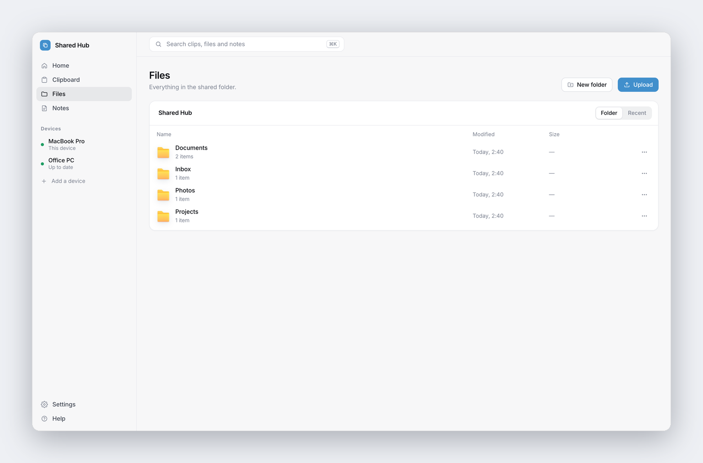
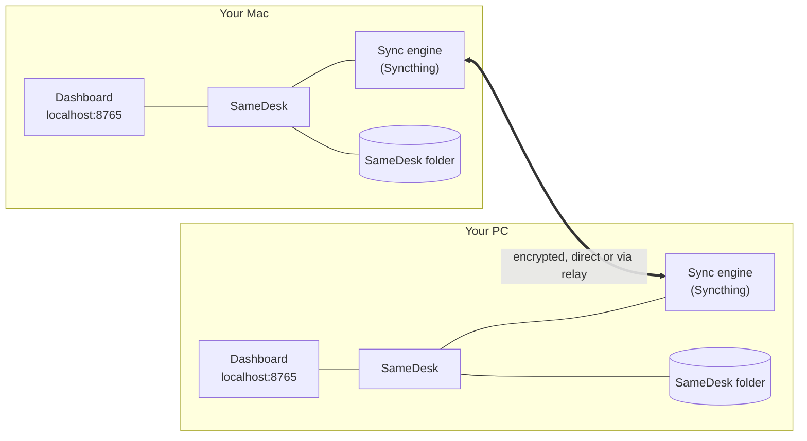

<p align="center">
  
</p>

<p align="center">
  
  
  
  
</p>

<p align="center">
  <a href="#get-started">Get started</a> &nbsp;·&nbsp;
  <a href="#pair-your-computers">Pair your computers</a> &nbsp;·&nbsp;
  <a href="#how-it-works">How it works</a> &nbsp;·&nbsp;
  <a href="#privacy-and-security">Privacy</a> &nbsp;·&nbsp;
  <a href="#roadmap">Roadmap</a>
</p>

<br>

<picture>
  <source media="(prefers-color-scheme: dark)" srcset="docs/images/hero-dark.png">
  
</picture>

<br>

Copy something on your Mac and it is waiting on your PC a second later. Drop a file on one computer and it appears on the other. Write a note at your desk and pick it up on your laptop. SameDesk is one small app for each computer. There are no accounts, no cloud and no servers to trust, because your devices talk directly to each other.

> [!NOTE]
> SameDesk is in active development. Sync, the dashboard, the clipboard, device pairing, the menu bar icon and installers work today. Signed builds and automatic updates are next; see the [roadmap](#roadmap).

<br>

## Why SameDesk

<table>
  <tr>
    <td width="33%" valign="top">
      <h3>Instant</h3>
      Press <kbd>⌘</kbd> <kbd>V</kbd> or <kbd>Ctrl</kbd> <kbd>V</kbd> anywhere in the dashboard and it's on your other computer in about a second. Text, links, screenshots and files.
    </td>
    <td width="33%" valign="top">
      <h3>Private</h3>
      Everything travels directly between your devices, end-to-end encrypted. Nothing is stored anywhere else, and there is no account to create.
    </td>
    <td width="33%" valign="top">
      <h3>Effortless</h3>
      Install, open, pair once. It works on the same Wi-Fi or across the internet, keeps going when a computer is off, and catches up when it's back.
    </td>
  </tr>
</table>

<br>

## A closer look

<table>
  <tr>
    <td width="50%" valign="top">
      <picture>
        <source media="(prefers-color-scheme: dark)" srcset="docs/images/clipboard-dark.png">
        
      </picture>
      <p><b>Clipboard.</b> Every clip shown as what it is: text, a link card or an image. Pick one to see it in full, with who sent it, when, and whether it has reached your other device. <kbd>↵</kbd> copies it.</p>
    </td>
    <td width="50%" valign="top">
      <picture>
        <source media="(prefers-color-scheme: dark)" srcset="docs/images/pair-dark.png">
        
      </picture>
      <p><b>Pairing.</b> Open <i>Add a device</i> on one computer and the other appears by itself. Click <i>Pair</i>; the other computer asks right away, showing the same code. Accept. Not on the same network? Use a code instead.</p>
    </td>
  </tr>
  <tr>
    <td width="50%" valign="top">
      <picture>
        <source media="(prefers-color-scheme: dark)" srcset="docs/images/notes-dark.png">
        
      </picture>
      <p><b>Notes.</b> Start a note on one computer and continue on the other. Everything saves as you type.</p>
    </td>
    <td width="50%" valign="top">
      <picture>
        <source media="(prefers-color-scheme: dark)" srcset="docs/images/files-dark.png">
        
      </picture>
      <p><b>Files.</b> Browse, preview, upload, rename and delete in the shared folder. Deleted files go to the Trash or Recycle Bin, never straight to oblivion.</p>
    </td>
  </tr>
</table>

<br>

## Features

| | |
|---|---|
| **Shared clipboard** | Text, links, screenshots and files, with history, pins and search. Private clips stay hidden until hovered and delete themselves after 10 minutes. |
| **Know it arrived** | Your latest clip says *On Office PC* once it's there, or *Waiting for Office PC* while that computer is offline. |
| **Shared folder** | A normal folder on every computer, kept identical. Use it from Finder, Explorer or your file manager as well as the dashboard. |
| **Notes** | Synced notes with autosave. The newest edit wins, without conflict copies. |
| **Always at hand** | A quiet icon in the menu bar or tray shows whether you're up to date and opens SameDesk or the shared folder. It can start at login. |
| **Search everything** | <kbd>⌘</kbd> <kbd>K</kbd> finds clips, files and notes, and runs actions like *Send clipboard* or *New note*. |
| **Your phone too** | Scan a QR code to open the dashboard on a phone on the same Wi-Fi. |
| **Light and dark** | Follows your system, or pick one in Settings. |
| **Stays up to date** | New versions install themselves when sync is quiet, after checking their signature. Or choose *Update now* in Settings. |
| **Every desktop** | macOS (Apple Silicon and Intel), Windows (x64 and ARM) and Linux (x64 and ARM). |

<br>

## Get started

Download the installer for each computer from the [latest release](https://github.com/SyedAliMasoodBukhari/Samedesk/releases/latest):

| | Download | Install |
|---|---|---|
| **macOS** | `SameDesk-<version>.dmg` (Apple Silicon and Intel) | Open it and drag **SameDesk** to **Applications**. |
| **Windows** | `SameDesk-<version>-windows-x64-setup.exe` (or `arm64`) | Run it. It installs for you only and needs no admin rights. |
| **Linux** | `.deb`, `.rpm` or `.AppImage` | `sudo apt install ./samedesk_<version>_amd64.deb`, or make the AppImage executable and run it. |

> [!IMPORTANT]
> Early releases are not signed yet, so the first launch needs one extra step.
> **macOS:** if it says the app can't be checked, open **System Settings → Privacy & Security** and choose **Open Anyway**.
> **Windows:** if SmartScreen appears, choose **More info → Run anyway**.

SameDesk creates a **SameDesk** folder in your home folder, adds its icon to the menu bar (or the tray on Windows and Linux) and opens the dashboard at `http://localhost:8765`. Do the same on your other computer, then pair them.

<details>
<summary><b>Options</b></summary>

<br>

```text
-folder   the shared folder              (default: ~/SameDesk)
-name     how this computer appears      (default: its system name)
-port     dashboard port                 (default: 8765)
-data     settings and sync database     (default: your OS's app-data folder)
-open     open the dashboard on start    (default: true)
-tray     show the menu bar / tray icon  (default: true; off runs in the background only)
-version  print the version and exit
```

</details>

<br>

## Pair your computers

1. On one computer, choose **Add a device**. Your other computer appears as long as SameDesk is running on it and it's on the same network.
2. Click **Pair** next to it.
3. The other computer asks straight away, *"MacBook Pro wants to connect"*, opening SameDesk if it isn't on screen. Check that both show the same six-digit code, then click **Accept**.

That's it. From now on they sync by themselves, at home, at the office or across the internet.

> [!TIP]
> If the computers aren't on the same network, copy the **device code** from one and paste it into the other. The same confirmation appears.

<br>

## How it works



- **One program per computer.** The dashboard and the [Syncthing](https://syncthing.net) sync engine run in the same process. Syncthing is embedded as a Go library at a pinned release, with its own identity, settings and ports, so it never interferes with a Syncthing you already run.
- **The folder is the database.** Clips and notes live in the shared folder under `.samedesk/`. Each computer writes only its own file (`.samedesk/clips/<device-id>.json`) and reads the others', so two computers never edit the same file and Syncthing never has to resolve a conflict.
- **Changes go out immediately.** After every change the hub tells the engine exactly what changed, instead of waiting for the next scan.

<br>

## Privacy and security

- **No accounts, no cloud.** Data lives on your computers and nowhere else.
- **Encrypted end to end.** Devices connect over TLS, and each device's ID is the fingerprint of its own key, so a device can't be impersonated.
- **You approve every device.** Pairing needs a click on both computers, and a check code derived from both device IDs lets you confirm you're pairing with the right one.
- **Discovery only while you're pairing.** Nothing is announced on the local network until someone opens *Add a device*; then the SameDesk computers there answer with their name and device code. A pairing request only opens SameDesk on screen when it comes from a device on the same network that is pairing at that moment.
- **Updates are signed.** SameDesk checks for new versions on this project's GitHub releases and installs one only if its checksum list is signed with the SameDesk release key, whose public half is built into the app, and the download matches. Turn automatic updates off in Settings if you prefer.
- **Relays can't read your data.** When a direct connection isn't possible, Syncthing's community relays pass along encrypted traffic they cannot decrypt.
- **The dashboard is yours alone.** It answers only this computer's browser, and phones only after scanning the key link shown in Settings.

<br>

## FAQ

<details>
<summary><b>Do I need to install Syncthing?</b></summary>
<br>
No. SameDesk includes it. If you already use Syncthing, both run side by side without touching each other.
</details>

<details>
<summary><b>Does it work when my computers are on different networks?</b></summary>
<br>
Yes. Syncthing finds your devices through its discovery servers and connects directly when it can, or through an encrypted relay when it can't.
</details>

<details>
<summary><b>What happens when a computer is off?</b></summary>
<br>
Everything you send waits. The dashboard shows it as <i>Waiting for Office PC</i>, and it arrives as soon as that computer is back.
</details>

<details>
<summary><b>Can I use it on my phone?</b></summary>
<br>
Yes, as a web app: scan the QR code in Settings while your phone is on the same Wi-Fi as one of your computers. A native phone app isn't planned yet.
</details>

<details>
<summary><b>Where are my files?</b></summary>
<br>
In the <b>SameDesk</b> folder in your home folder (or wherever you point <code>-folder</code>). It's a normal folder, so you can also use it directly.
</details>

<br>

## Build from source

Requires [Go](https://go.dev) 1.26 or newer.

```bash
make                     # this computer, into bin/
make release             # all six platforms, into dist/
make test                # vet and tests
make dmg                 # macOS .dmg (on a Mac)
make windows-installer   # Windows installers (needs NSIS: brew install makensis / apt install nsis)
make linux-packages      # .deb and .rpm
```

Pushing a tag such as `v0.1.0` builds every installer on GitHub Actions into a draft release, and signs its checksum list with the `SAMEDESK_SIGNING_KEY` secret (see `tools/sign`). Apps only update to signed releases.

- `-tags noassets` leaves out Syncthing's own web interface; SameDesk is the interface.
- macOS builds use cgo so the sync engine can watch the folder with FSEvents. Windows and Linux build without cgo (pure-Go SQLite), so every platform builds from any computer.

<details>
<summary><b>Project layout</b></summary>

<br>

```text
cmd/samedesk/      entry point and flags
internal/engine/    embedded Syncthing: identity, config, folder, pairing
internal/hub/       dashboard server: clipboard, notes, files, sync status, per-OS bits
internal/pairing/   finding nearby devices when "Add a device" is open
internal/tray/      menu bar and tray icon
internal/autostart/ start at login on each OS
internal/update/    signed automatic updates
tools/sign/         release signing key and signatures
packaging/          icons, .dmg, Windows installer and Linux packages
web/                the dashboard, compiled into the binary
docs/images/        screenshots for this page
```

</details>

<br>

## Roadmap

- [x] One app with an embedded sync engine
- [x] Clipboard, files, notes, search and phone access
- [x] Pairing with nearby discovery, device codes and check codes
- [x] Menu bar and tray icon, start at login
- [x] Installers: `.dmg`, Windows installer, AppImage, `.deb` and `.rpm`
- [ ] Signed and notarised builds, so first launch needs no extra step
- [ ] Homebrew, winget and Flathub
- [x] Automatic, signed updates (macOS, Windows and AppImage; `.deb` and `.rpm` update through your package manager)

<br>

## Contributing

Issues and pull requests are welcome. Run `make test` before sending a change, and keep the dashboard free of external dependencies: it's a single file that ships inside the binary.

<br>

## Licence and credits

SameDesk is released under the [MIT licence](LICENSE).

It stands on [Syncthing](https://syncthing.net) (Mozilla Public License 2.0), included unmodified, and uses [Microsoft Fluent Emoji](https://github.com/microsoft/fluentui-emoji) (MIT) for its 3D icons. See [NOTICE](NOTICE) for details. "Syncthing" is a trademark of the Syncthing Foundation; SameDesk is an independent project and is not affiliated with it.

<br>

<p align="center">
  <a href="https://www.kolonx.com"></a>
</p>
